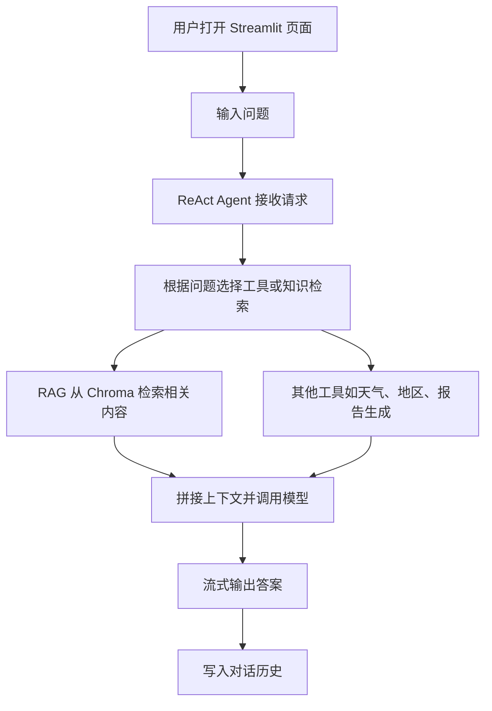

<h1 align="center">🤖 LangChain ReAct Agent + RAG 智能客服</h1>

<p align="center">中文 | <a href="./docs/README_EN.md">EN</a></p>

本项目是一个基于 Streamlit、LangChain、ReAct Agent 和 RAG 检索增强的机器人智能客服示例，面向扫地机器人场景，支持提问、检索知识库、调用工具和流式输出。

## 🧭 系统流程

<div align="center">



</div>

## ✨ 项目功能

- 基于 Streamlit 的聊天式机器人界面
- 基于 LangChain ReAct 的工具调用能力
- 基于 RAG 的知识检索增强
- 支持流式输出，回答逐步展示
- 支持会话状态与聊天历史保留
- 集成扫地机器人场景下的问答、报告和外部数据能力

## 📦 项目结构

```text
P5_LangChain_ReAct_Agent_demo/
├── app.py                  # Streamlit 主入口
├── agent/                  # ReAct Agent 与工具实现
├── config/                 # 模型、向量库和提示词配置
├── data/                   # 业务知识数据与示例数据
├── model/                  # 模型工厂
├── prompts/                # 系统提示词与 RAG 提示词
├── rag/                    # RAG 检索与向量库服务
├── utils/                  # 路径、配置、日志等工具
├── chroma_db/              # 本地 Chroma 持久化目录（建议忽略）
├── logs/                   # 本地运行日志（建议忽略）
└── md5.text                # 去重标记文件（建议忽略）
```

## 🛠️ 技术栈

- Python
- Streamlit
- LangChain
- LangChain Community
- Chroma
- Tongyi / Qwen
- DashScope Embeddings

## 🔒 发布到 GitHub 前的注意事项

以下内容属于本地运行产物或环境相关文件，建议不要提交到仓库，已经写入 `.gitignore`：

- `.vscode/`
- `logs/`
- `chroma_db/`
- `md5.text`
- `chat_history/`
- `__pycache__/` 和 `*.pyc`
- `*.log`

当前项目代码中没有发现明文 API Key，但如果你本地后续加入了 `.env`、密钥文件或调试配置，请继续保持忽略，不要提交到 GitHub。

## ⚙️ 环境准备

建议使用 Python 3.10+，并安装项目依赖：

```bash
pip install streamlit langchain langchain-community langchain-core langchain-chroma langchain-text-splitters pyyaml
```

如果你使用通义千问 / DashScope 模型，请先在本地配置对应的 API Key，并确保不要把密钥写入仓库。

## ▶️ 运行方式

在项目根目录执行：

```bash
streamlit run app.py
```

## 🧪 使用说明

1. 启动页面后，在输入框中输入问题。
2. Agent 会根据问题决定是否调用工具或检索知识库。
3. 模型以流式方式返回答案，并保留会话上下文。

## 📚 英文版

英文说明见 [docs/README_EN.md](docs/README_EN.md)。
