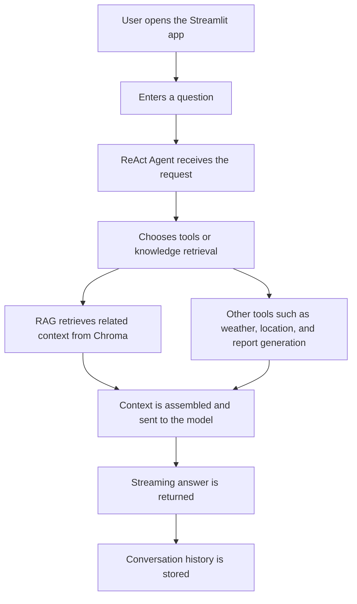

<h1 align="center">🤖 LangChain ReAct Agent + RAG Customer Assistant</h1>

<p align="center"><a href="../README.md">中文</a> | EN</p>

This project is a Streamlit-based customer assistant demo built with LangChain, a ReAct agent, and RAG (Retrieval-Augmented Generation). It is designed for a robot-vacuum support scenario and supports tool calling, knowledge retrieval, and streaming responses.

## 🧭 Workflow

<div align="center">



</div>

## ✨ Features

- Streamlit chat-style interface
- LangChain ReAct tool calling
- RAG-enhanced knowledge answering
- Streaming output for a better user experience
- Session state and chat history retention
- Robot-vacuum-specific Q&A, reporting, and external data tools

## 📦 Project Structure

```text
P5_LangChain_ReAct_Agent_demo/
├── app.py                  # Streamlit entry point
├── agent/                  # ReAct agent and tools
├── config/                 # Model, vector store, and prompt configs
├── data/                   # Domain knowledge and sample data
├── model/                  # Model factories
├── prompts/                # System and RAG prompts
├── rag/                    # RAG retrieval and vector store services
├── utils/                  # Path, config, and logging helpers
├── chroma_db/              # Local Chroma persistence directory (ignored)
├── logs/                   # Local runtime logs (ignored)
└── md5.text                # Deduplication marker file (ignored)
```

## 🛠️ Tech Stack

- Python
- Streamlit
- LangChain
- LangChain Community
- Chroma
- Tongyi / Qwen
- DashScope Embeddings

## 🔒 Before Publishing to GitHub

The following files and folders are local runtime artifacts or environment-specific files and should not be committed. They are already covered by `.gitignore`:

- `.vscode/`
- `logs/`
- `chroma_db/`
- `md5.text`
- `chat_history/`
- `__pycache__/` and `*.pyc`
- `*.log`

No plain-text API key was found in the project code. If you later add a `.env` file, secret file, or local debug settings, keep them out of version control as well.

## ⚙️ Setup

Use Python 3.10+ and install the dependencies:

```bash
pip install streamlit langchain langchain-community langchain-core langchain-chroma langchain-text-splitters pyyaml
```

If you use Tongyi / DashScope models, configure the required API key locally and do not commit it to the repository.

## ▶️ Run

From the project root:

```bash
streamlit run app.py
```
